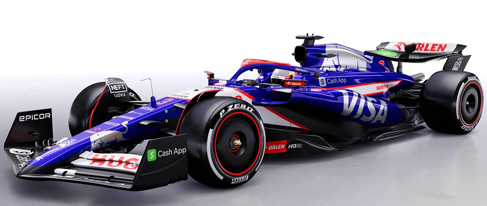
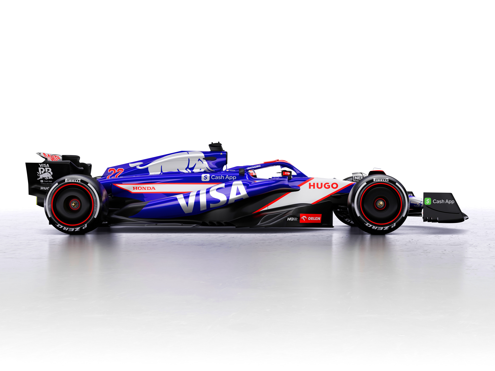
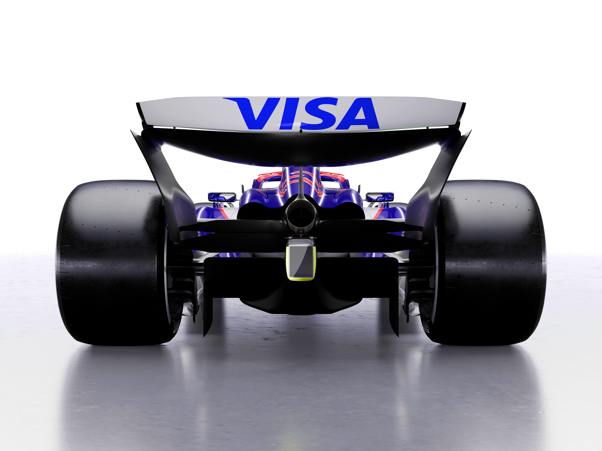

<!-- Cabeçalho -->
<header>
    <h1></h1>
    <nav>
        <ul>
            <li><a href="#home">Home</a></li>
            <li><a href="#news">Notícias</a></li>
            <li><a href="https://www.ferrari.com">Equipes</a></li>
            <li><a href="#contact">Contato</a></li>
        </ul>
    </nav>
</header>

<!-- Conteúdo principal -->
<main>
    <section id="news">
        <h2>Últimas Notícias</h2>
        
Acompanhe as últimas notícias da Fórmula 1 aqui.

    </section>

  <section id="teams">
        <h2>Equipes</h2>
        
Informações sobre as equipes da Fórmula 1.

    </section>
    
   <!-- Carrossel de Imagens -->
    <section id="carousel">
        

            

                
                
                
            

        

    </section>
</main>

<!-- Rodapé -->
<footer>
    
&copy; 2024 Página de Fórmula 1. Todos os direitos reservados.

    <nav>
        <ul>
            <li><a href="#privacy">Política de Privacidade</a></li>
            <li><a href="#terms">Termos de Uso</a></li>
        </ul>
    </nav>
</footer>

